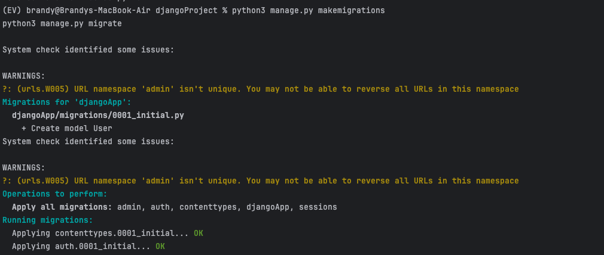
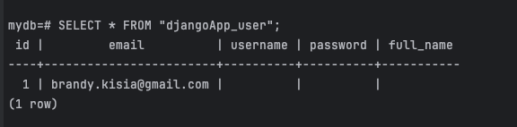

# Login Image

La pàgina d'inici de sessió permet als usuaris introduir el seu correu electrònic i contrasenya. Un cop la sessió iniciada amb èxit, els usuaris són redirigits a la pàgina d'inici. Si les credencials són incorrectes, es mostra un missatge d'error indicant que les credencials són incorrectes.

##  funcionalitat de login sense sessió
Redirigeix a la pàgina d'inici si les credencials són vàlides
Verifica les credencials a la base de dades i redirigeix a la pàgina d'inici.

## funcionalitat login amb sessió
Emmagatzema la ID de l'usuari a la sessió i permet accedir a la pàgina d'inici fins que l'usuari tanqui la sessió.
Emmagatzema la ID de l'usuari a la sessió i manté la sessió fins al tancament.

## funcionalitat de logout
 Neteja la sessió i redirigeix a la pàgina de login.

# Migration Image

La imatge següent conté el procés de migració al terminal

# Users Image

La imatge següent mostra els usuaris de la base de dades
