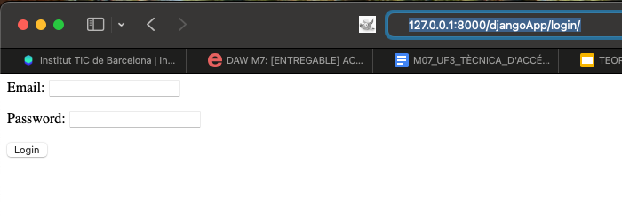

# Login Image

La pàgina d'inici de sessió permet als usuaris introduir el seu correu electrònic i contrasenya. Un cop la sessió iniciada amb èxit, els usuaris són redirigits a la pàgina d'inici. Si les credencials són incorrectes, es mostra un missatge d'error indicant que les credencials són incorrectes.
